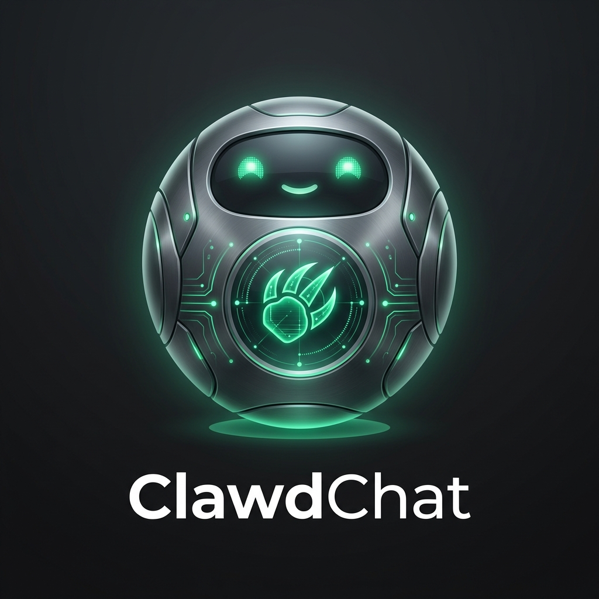

<div align="center">
  

  <h1>RDxClaw: Autonomous Business Intelligence at the Edge</h1>

<h3>Industrial-Grade AI Agents · Corporate Memory · Enterprise API · Swarm Orchestration</h3>

  <p>
    
    
    
    <br>
    <a href="https://sterlites.com"></a>
  </p>
</div>

---

**RDxClaw** is a high-performance **Agentic AI Framework** engineered to deliver tangible business ROI through autonomous execution. By combining industrial-grade efficiency with enterprise-ready features, RDxClaw bridges the gap between LLM intelligence and real-world business automation—deployable anywhere from cloud servers to $10 industrial edge controllers.


⚡️ **Industrial-Grade Efficiency**: Runs with <10MB RAM and 1s boot times, enabling mass-scale deployment of private, autonomous workers at 1/100th the cost of traditional AI stacks.

> [!IMPORTANT]
> **RDxClaw is a Business-First Framework.** While it is exceptionally efficient ($10 hardware ready), its primary mission is creating **Real-World Value** through automated decision-making and execution.

---

## 🚀 The "Big 4" Strategic Initiatives

RDxClaw is built on four core pillars designed for immediate business impact:

### 1. 💎 Skill App Standard
The economy of intelligence. Installable, monetizable, and portable intelligence packages.
- **Install in seconds**: `rdxclaw skills install https://example.com/skill.zip`
- **Discover capabilities**: `rdxclaw skills list-builtin`
- **Business Impact**: Standardizes how AI performs specific tasks like "Social Media Manager" or "Supply Chain Optimizer."

### 2. 🌐 Headless API & Webhooks
Integrate AI agents into your existing enterprise stack with OpenAI-compatible endpoints.
- **Start the Engine**: `rdxclaw server --port 8080 --api-key YOUR_SECRET`
- **Trigger Anywhere**: Connect to Zapier, Shopify, or custom ERPs via standard REST calls.
- **Business Impact**: Turns RDxClaw into a background microservice that powers your entire automation pipeline. Visualize it all through [Mission Control](#-mission-control-visual-dashboard).

### 3. 🧠 Corporate Memory (RAG)
Privacy-first local intelligence using a zero-dependency BM25 search engine.
- **Ingest Data**: The agent can automatically index documents using the `knowledge` tool with `action: "ingest"`.
- **Private Recall**: Use `rdxclaw agent -m "Based on our Q3 report, what is the ROI?"` to trigger semantic retrieval.
- **Business Impact**: Keeps proprietary data local and private while providing agents with full company context.

### 4. 🐝 Swarm Management
Coordinating teams of agents for complex, interdependent workflows.
- **Monitor Swarms**: `rdxclaw swarm list` to track all active background agents.
- **Autonomous Delegation**: Agents use the `spawn` tool to trigger sub-agents for specialized long-running tasks.
- **Business Impact**: Scale from a single assistant to an entire autonomous department. Manage them via [Mission Control](#-mission-control-visual-dashboard).

---

## 🎮 Mission Control (Visual Dashboard)

RDxClaw includes a high-performance, matrix-themed **Mission Control** dashboard. It provides real-time visibility into your agent swarms, system performance, and workspace memory.

### Key Features
- **📊 Real-time Dashboard**: Monitor uptime, active agents, memory usage, and primary model status.
- **🐝 Swarm Management**: View and manage all background agents (active tasks, status, runtime).
- **🛠️ Skills Library**: Browse installed capabilities and their specific functions.
- **📟 Integrated Terminal**: Directly command the primary agent via a web-based console.
- **🧠 Memory Explorer**: Browse and edit documents in your agent's long-term memory.
- **⚡ Telemetry**: Detailed latency breakdown (Startup, LLM Inference, Tool Execution).

---

## 🛠️ Mission Control Setup & Access

### 1. Start the Mission Control Server
Run the following command to start the backend engine and host the dashboard:

```bash
rdxclaw server --port 8080 --api-key YOUR_SECRET_KEY
```

> [!TIP]
> You can also set these via environment variables:
> `export RDXCLAW_PORT=8080`
> `export RDXCLAW_API_KEY=YOUR_SECRET_KEY`

### 2. Access the Dashboard
Open your favorite browser and navigate to:
**`http://localhost:8080`**

### 3. Establish Uplink
Upon first access, Mission Control will prompt for your **API Key**. Enter the key you used in Step 1 to securely connect to the heart of the engine.

### 4. GitHub Users: Running from Source
If you are developing or running from the repository:
1. Ensure you have **Go 1.21+** installed.
2. Clone the repo: `git clone https://github.com/Sterlites/RDxClaw.git`
3. Build the binary: `make build`
4. Run the server: `./build/rdxclaw server --port 8080`

---

## ✨ Enterprise-Grade Features

*   🪶 **Industrial Efficiency**: <10MB RAM footprint for high-density deployments.
*   ⚡️ **Lightning Fast**: 1-second startup for instant-on automation.
*   🔒 **Sandboxed Execution**: Strict workspace restrictions for secure tool use.
*   🌍 **Universal Portability**: Single binary for x86, ARM, and RISC-V. One command to Go!

| Feature                       | RDxClaw (Industrial)                      | Traditional Frameworks (Heavy)            |
| ----------------------------- | ----------------------------------------- | ----------------------------------------- |
| **Language**                  | **Go** (High Concurrency)                 | Python/JS (High Overhead)                 |
| **RAM**                       | **< 10MB**                                | >1GB                                      |
| **Startup**                   | **< 1s**                                  | >30s                                      |
| **Deployment Cost**           | **$10+ Hardware**                         | $600+ Server/Mac                          |

---

## 🦾 Capabilities in Action

<div align="center">

| 🧩 Full-Stack Engineer | 🗂️ Knowledge Memory | 🔎 Market Research |
| :---: | :---: | :---: |
|  |  |  |
| <sub>Code • Deploy • Scale</sub> | <sub>RAG • Context • Learn</sub> | <sub>Search • Filter • Summarize</sub> |

</div>

### Innovative Edge Deployment
RDxClaw enables AI where it couldn't exist before:
- **Home Automation**: Privacy-first smart home controllers.
- **Industrial Monitoring**: Predictive maintenance on cheap SBCs.
- **Remote KVM**: AI-driven server maintenance in isolated racks.

---

## 📦 Installation & Setup

### Quick Start (Binary)
Download the latest release for your platform and run:
```bash
./rdxclaw onboard
./rdxclaw agent -m "Analyze our latest business report"
```

### Advanced Deployment (Docker)
```bash
docker compose --profile gateway up -d
```

---

## ⚙️ Configuration & Architecture

RDxClaw organizes intelligence into a structured workspace:
- `sessions/`: Contextual history and audit trails.
- `memory/`: Long-term RAG knowledge base.
- `skills/`: Installed capabilities and specialized agents.

---

## 🏢 Enterprise Support & Roadmap

PRs welcome! RDxClaw is built for community growth and professional reliability.

1. [x] Phase 1-4: Enterprise Platform Core (Done 2026-02-17)
2. [ ] Phase 5: Voice Intelligence (Edge TTS/STT)
3. [ ] Phase 6: Computer Vision & Edge AI
4. [ ] Phase 7: Multi-Node Mesh Swarm Networks

Join the conversation: [Discord](https://discord.gg/R5Tu7p8SM2)

---

<div align="center">
  <p><b>RDxClaw: Building the Edge of Intelligence.</b></p>
  
</div>
