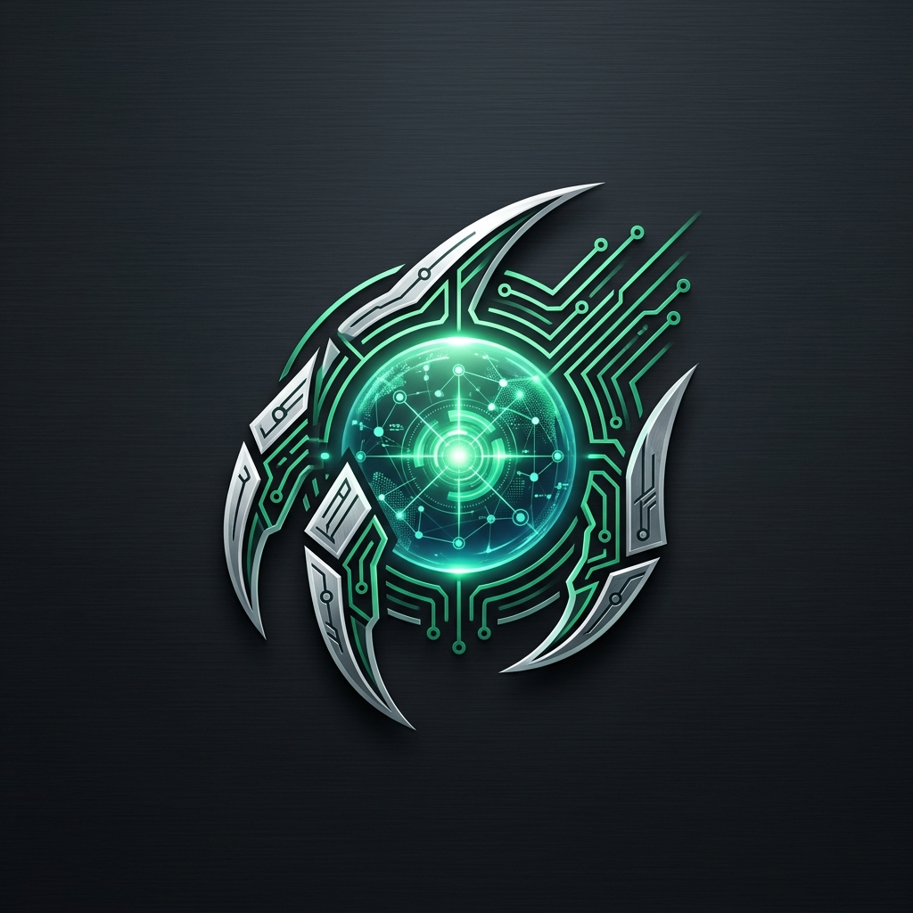
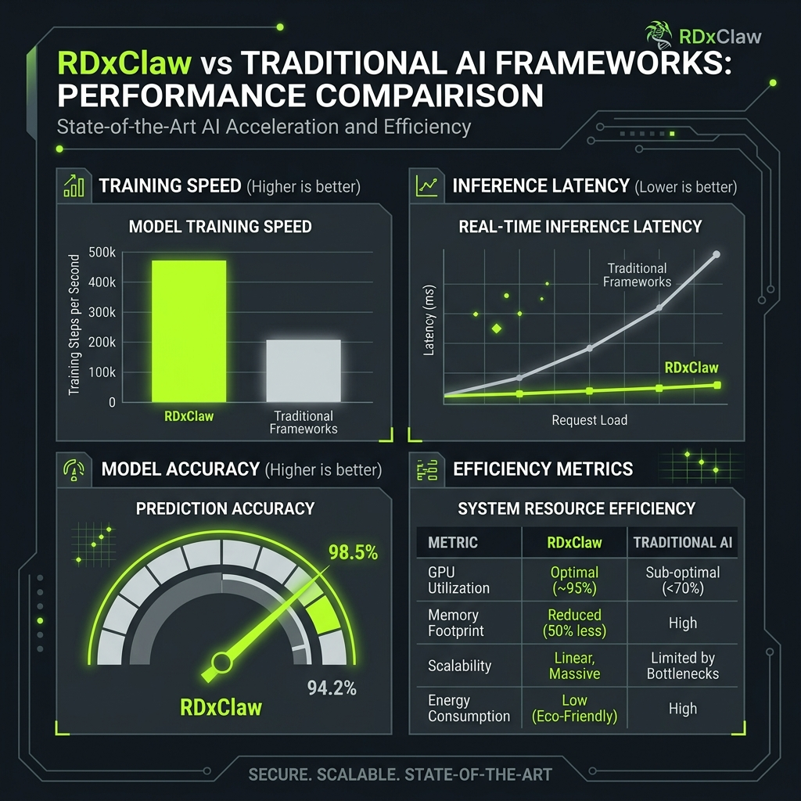
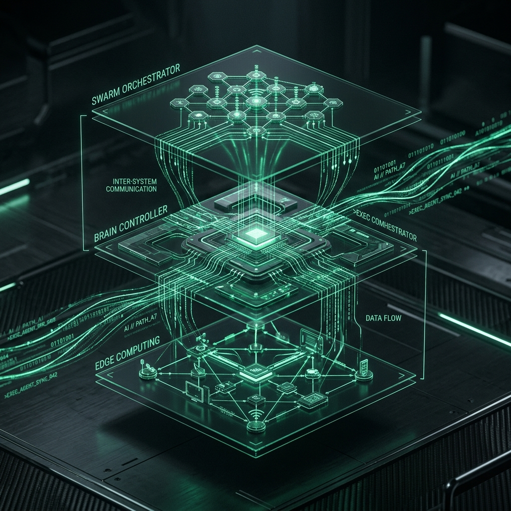

<div align="center">
  

  <h1>RDxClaw: Autonomous Business Intelligence at the Edge</h1>

<h3>Industrial-Grade AI Agents · Corporate Memory · Enterprise API · Swarm Orchestration</h3>

  <p>
    
    
    
    <br>
    <a href="https://sterlites.com"></a>
  </p>
</div>

---

**RDxClaw** is a high-performance **Agentic AI Framework** engineered to deliver tangible business ROI through autonomous execution. By combining industrial-grade efficiency with enterprise-ready features, RDxClaw bridges the gap between LLM intelligence and real-world business automation—deployable anywhere from cloud servers to $10 industrial edge controllers.



⚡️ **Industrial-Grade Efficiency**: Runs with <10MB RAM and 1s boot times, enabling mass-scale deployment of private, autonomous workers at 1/100th the cost of traditional AI stacks.

> [!IMPORTANT]
> **RDxClaw is a Business-First Framework.** While it is exceptionally efficient ($10 hardware ready), its primary mission is creating **Real-World Value** through automated decision-making and execution.

---

## 🚀 The "Big 4" Strategic Initiatives

RDxClaw is built on four core pillars designed for immediate business impact:

### 1. 💎 Skill App Standard
The economy of intelligence. Installable, monetizable, and portable intelligence packages.
- **Install in seconds**: `rdxclaw skills install https://example.com/skill.zip`
- **Discover capabilities**: `rdxclaw skills list-builtin`
- **Business Impact**: Standardizes how AI performs specific tasks like "Social Media Manager" or "Supply Chain Optimizer."

### 2. 🌐 Headless API & Webhooks
Integrate AI agents into your existing enterprise stack with OpenAI-compatible endpoints.
- **Start the Engine**: `rdxclaw server --port 8080 --api-key YOUR_SECRET`
- **Trigger Anywhere**: Connect to Zapier, Shopify, or custom ERPs via standard REST calls.
- **Business Impact**: Turns RDxClaw into a background microservice that powers your entire automation pipeline. Visualize it all through [Mission Control](#-mission-control-visual-dashboard).

### 3. 🧠 Corporate Memory (RAG)
Privacy-first local intelligence using a zero-dependency BM25 search engine.
- **Ingest Data**: The agent can automatically index documents using the `knowledge` tool with `action: "ingest"`.
- **Private Recall**: Use `rdxclaw agent -m "Based on our Q3 report, what is the ROI?"` to trigger semantic retrieval.
- **Business Impact**: Keeps proprietary data local and private while providing agents with full company context.

### 4. 🐝 Swarm Management
Coordinating teams of agents for complex, interdependent workflows.
- **Monitor Swarms**: `rdxclaw swarm list` to track all active background agents.
- **Autonomous Delegation**: Agents use the `spawn` tool to trigger sub-agents for specialized long-running tasks.
- **Business Impact**: Scale from a single assistant to an entire autonomous department. Manage them via [Mission Control](#-mission-control-visual-dashboard).

---

## 🎮 Mission Control (Visual Dashboard)

RDxClaw includes a high-performance, matrix-themed **Mission Control** dashboard. It provides real-time visibility into your agent swarms, system performance, and workspace memory — all streamed live via Server-Sent Events (SSE).

### Key Features
- **📊 Real-time Dashboard**: Live uptime, active agents, memory, goroutines, heap objects, threads, and model status — all pushed via SSE with zero polling.
- **🐝 Swarm Management**: View, monitor, and terminate background sub-agents. The primary kernel process is always visible and protected.
- **🛠️ Skills Library**: Browse installed capabilities, view descriptions, and execute test payloads directly from the UI.
- **📟 Integrated Terminal**: Full streaming chat console that pipes directly into the agent loop. Supports intermediate thoughts, multi-turn context, and latency tracking per response.
- **🧠 Memory Explorer**: Hierarchical file tree with expand/collapse navigation. Read and live-edit workspace documents with syntax highlighting (Go, Markdown).
- **📋 Mission Logs**: Session persistence layer — view all recorded missions, turn counts, timestamps, and statuses. Resume interrupted sessions with one click.
- **⚡ Latency Telemetry**: Three-panel breakdown (Last Response, Session Average, Global Average) covering Startup, Context Build, LLM Inference, Tool Execution, and Response Prep — with a live pulse chart.
- **🎨 Command Palette**: `Ctrl+Space` launches a VS Code-style command palette for instant navigation, theme switching, file search, and bulk agent control.
- **💬 Global Terminal Drawer**: A persistent, slide-up chat drawer accessible from any tab — never lose your agent conversation while navigating.
- **🛡️ Failsafe Recovery**: Automatic detection of interrupted sessions on boot with a one-click resume overlay. No data is lost during process crashes or network failures.
- **🎭 Theme Engine**: Three built-in themes — **Matrix** (default green-on-black), **Zion** (high-contrast blue/white), and **Neuromancer** (magenta/indigo retrowave). Persisted via `localStorage`.
- **🔒 XSS Hardened**: All user-facing content (activity feed, chat messages, event payloads) is escaped before DOM injection.

---

## 🛠️ Mission Control Setup & Access

### 1. Configuration (Required)
Before starting the server, you must set an API key. This acts as the master password for your Mission Control dashboard to protect your local files and agents.
Copy the example environment file:
```bash
cp .env.example .env
```
Open `.env` and set `RDXCLAW_SERVER_API_KEY="your_secure_password"`.

### 2. Start the Server
Run the following command to start the backend engine and host the dashboard:

```bash
rdxclaw server --port 8080
```

> [!TIP]
> You can also configure the environment via terminal variables instead of `.env`:
> `export RDXCLAW_PORT=8080`
> `export RDXCLAW_SERVER_API_KEY=your_secure_password`
> `export RDXCLAW_PROVIDER=anthropic|google|openai|nvidia`
> `export RDXCLAW_API_KEY=YOUR_AI_API_KEY`
> `export RDXCLAW_MODEL=your-preferred-model`

### 3. Access the Dashboard
Open your favorite browser and navigate to:
**`http://localhost:8080`**

### 4. Establish Uplink
Upon first access, Mission Control will show an **ACCESS_RESTRICTED** popup. Enter the exact same password you set for `RDXCLAW_SERVER_API_KEY` in Step 1. Your browser will save this key and securely authenticate you for all future requests.

### 5. GitHub Users: Running from Source
If you are developing or running from the repository:
1. Ensure you have **Go 1.21+** installed.
2. Clone the repo: `git clone https://github.com/Sterlites/RDxClaw.git`
3. Configure `.env` as shown in Step 1.
4. Build the binary: `make build`
5. Run the server: `./build/rdxclaw server --port 8080`

---

## ✨ Enterprise-Grade Features

*   🪶 **Industrial Efficiency**: <10MB RAM footprint for high-density deployments.
*   ⚡️ **Lightning Fast**: 1-second startup for instant-on automation.
*   🔒 **Sandboxed Execution**: Strict workspace restrictions for secure tool use.
*   ♾️ **Quota Resilience**: Auto-Provider Fallbacks seamlessly catch rate limits/quota exhaustion and instantly swap API keys mid-task without context loss.
*   🛡️ **Session Failsafe**: Per-turn state checkpointing with automatic crash recovery. Resume any interrupted mission without data loss.
*   📡 **Real-time SSE Uplink**: Server-Sent Events push live telemetry, activity events, and system status to Mission Control with zero polling overhead.
*   🌍 **Universal Portability**: Single binary for x86, ARM, and RISC-V. One command to Go!

<p align="center">
  
</p>

| Feature                       | RDxClaw (Industrial)                      | Traditional Frameworks (Heavy)            |
| ----------------------------- | ----------------------------------------- | ----------------------------------------- |
| **Language**                  | **Go** (High Concurrency)                 | Python/JS (High Overhead)                 |
| **RAM**                       | **< 10MB**                                | >1GB                                      |
| **Startup**                   | **< 1s**                                  | >30s                                      |
| **Deployment Cost**           | **$10+ Hardware**                         | $600+ Server/Mac                          |

---

## 🦾 Capabilities in Action

<div align="center">

| 🧩 Full-Stack Engineer | 🗂️ Knowledge Memory | 🔎 Market Research |
| :---: | :---: | :---: |
|  |  |  |
| <sub>Code • Deploy • Scale</sub> | <sub>RAG • Context • Learn</sub> | <sub>Search • Filter • Summarize</sub> |

</div>

### Innovative Edge Deployment
RDxClaw enables AI where it couldn't exist before:
- **Home Automation**: Privacy-first smart home controllers.
- **Industrial Monitoring**: Predictive maintenance on cheap SBCs.
- **Remote KVM**: AI-driven server maintenance in isolated racks.

---

## 📦 Installation & Setup

### Quick Start (Binary)
Download the latest release for your platform and run:
```bash
./rdxclaw onboard
./rdxclaw agent -m "Analyze our latest business report"
```

### Advanced Deployment (Docker)
```bash
docker compose --profile gateway up -d
```

### 🚢 Continuous Deployment (VPS)
For teams requiring automated deployments to production environments:
1.  **Configure GitHub Secrets**: Set up `VPS_HOST`, `VPS_USER`, and `VPS_SSH_KEY` in your repository settings.
2.  **Define Environment Variables**: Ensure `RDXCLAW_PROVIDER`, `RDXCLAW_API_KEY`, and `RDXCLAW_MODEL` are added as secrets to inject into the deployment environment.
3.  **Automated Service Management**: The CI/CD pipeline (`.github/workflows/deploy-vps.yml`) intelligently detects your host environment, automatically managing `systemd` service files with root/sudo access or gracefully falling back to `nohup` for background execution.

---

## ⚙️ Configuration & Architecture

RDxClaw organizes intelligence into a structured workspace:
- `sessions/`: Contextual history and audit trails.
- `memory/`: Long-term RAG knowledge base.
- `skills/`: Installed capabilities and specialized agents.

<p align="center">
  
</p>

---

## ♾️ Multi-API Quota Fallback (Enterprise)

RDxClaw supports **automatic, mid-task provider rotation**. If your primary API key hits a quota limit (429) or runs out of credits, the agent immediately swaps to a fallback key/model without losing any session context.

### Setup
Configure fallbacks in your `~/.rdxclaw/config.json` by adding a `fallbacks` array reachable under `agents.defaults`:

```json
{
  "agents": {
    "defaults": {
      "provider": "openai",
      "model": "gpt-4o",
      "fallbacks": [
        {
          "provider": "anthropic",
          "model": "claude-3-5-sonnet",
          "api_key": "sk-ant-..."
        },
        {
          "provider": "openai",
          "model": "gpt-4o",
          "api_key": "sk-proj-..."
        }
      ]
    }
  }
}
```

- **Automatic Detection**: Seamlessly catches rate limits and "insufficient quota" errors.
- **Zero-Loss Handoff**: The agent retries the current turn with the backup key, maintaining full memory.
- **Dashboard Alerts**: Mission Control displays a warning notification whenever a failover occurs.

---

---

## 📝 Recent Changes

| Commit | Description |
|--------|-------------|
| `7f3f7ad` | **XSS Safety** — Escaped all raw user/event content injected into Mission Control DOM to prevent cross-site scripting. |
| `5b0e97b` | **Server-Side Events** — Added SSE uplink (`/v1/events`) for real-time status, activity, and telemetry broadcasting to all connected clients. |
| `dcad6ff` | **Global Session Management** — Session persistence layer with list, resume, and interrupt detection for all agent tasks. |
| `f1828d2` | **Command Palette** — `Ctrl+Space` spotlight with navigation, theme switching, file search, and bulk agent control. |
| `c1b096c` | **Telemetry Premium** — Three-panel latency breakdown (Last/Session/Global) with live pulse chart and stacked bar visualizer. |
| `46444ee` | **Mission Control Overhaul** — Full Matrix-themed redesign with glassmorphism cards, CRT scanlines, typing cursors, and glitch effects. |
| `93c0d6d` | **Panic Recovery** — Added `recover()` guards around critical Go runtime paths to prevent silent crashes. |
| `4f91a03` | **Endpoint Restoration** — Fixed regression in file-listing and agent management endpoints after core overhaul. |
| `1e55d18` | **Core Overhaul** — Major refactor of agent loop, swarm management, and provider rotation architecture. |

---

## 🏢 Enterprise Support & Roadmap

PRs welcome! RDxClaw is built for community growth and professional reliability.

1. [x] Phase 1-4: Enterprise Platform Core (Done 2026-02-17)
2. [x] Phase 4.5: Mission Control & Failsafe Hardening (Done 2026-04-05)
3. [ ] Phase 5: Voice Intelligence (Edge TTS/STT)
4. [ ] Phase 6: Computer Vision & Edge AI
5. [ ] Phase 7: Multi-Node Mesh Swarm Networks

Join the conversation: [Discord](https://discord.gg/R5Tu7p8SM2)

---

<div align="center">
  <p><b>RDxClaw: Building the Edge of Intelligence.</b></p>
  
</div>
