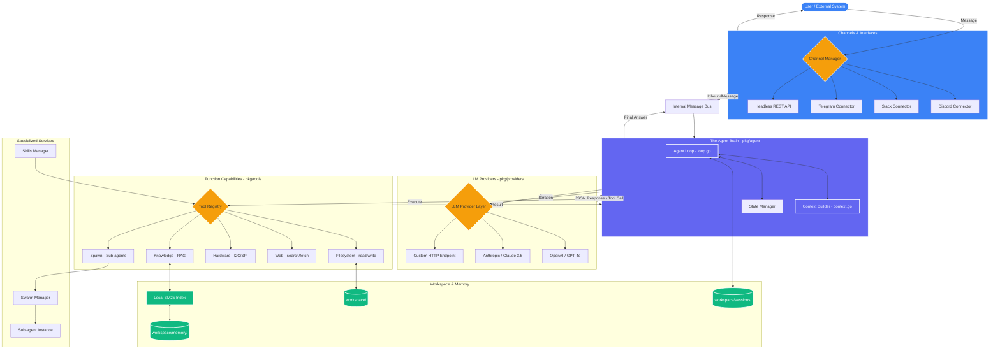

# RDxClaw Architectural Map

This diagram visualizes the flow of information and command execution within the RDxClaw framework.

---

## Interactive Flow Explanation

### 1. The Inbound Flow
A request enters through the **Channel Manager**. Whether it's a Slack message or a REST API call, it is normalized into an `InboundMessage` and sent over the internal **Message Bus**.

### 2. The Thought Process (Loop)
The **Agent Loop** picks up the message and:
1.  Loads the persistent **Session** history.
2.  Identifies the current **Workspace** state.
3.  Builds a context-rich prompt using the **Context Builder**.
4.  Queries the **LLM Provider**.

### 3. Tool Execution & RAG
If the LLM decides to take an action (e.g., "Read the sensors"), the agent routes the request through the **Tool Registry**. 
- For hardware tasks, it uses the **I2C/SPI** tools.
- For information retrieval, it queries the **Knowledge** tool, which searches the local **BM25 Index**.

### 4. The Iteration Loop
The result of any tool call is fed back into the **Agent Brain**. The brain then updates the context and asks the LLM, "With this new data, what's our next step?" This continues until a final answer is generated.

### 5. Swarms & Skills
- **Skills** are pre-packaged logic that can register new tools dynamically.
- **Swarms** allow the main agent to delegate long-running tasks to background sub-agents, keeping the main loop responsive.
