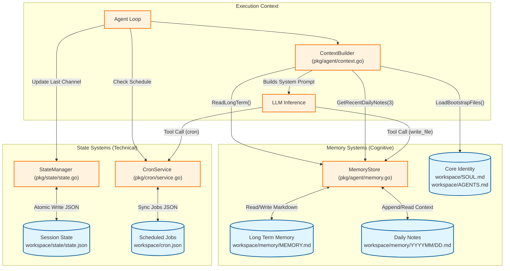

# rdxclaw Memory Architecture

This document describes the memory and state management architecture of the rdxclaw agent.

## Overview

rdxclaw operates on a file-based memory system designed for transparency and ease of manipulation. It differentiates between **Structured State** (technical, machine-readable) and **Unstructured Memory** (cognitive, LLM-readable).

## Architecture Diagram

## Component Details

### 1. MemoryStore (`pkg/agent/memory.go`)
Manages the agent's cognitive memory stored in Markdown files.
- **Long-Term Memory**: Stores persistent facts and user preferences in `memory/MEMORY.md`.
- **Daily Notes**: Stores episodic memory in `memory/YYYYMM/YYYYMMDD.md`.
- **Access Pattern**: The ContextBuilder injects `MEMORY.md` and the last 3 days of daily notes into every prompt.

### 2. StateManager (`pkg/state/state.go`)
Manages technical session state using JSON.
- **Session State**: Tracks the last active channel and chat ID to support seamless conversation resumption.
- **Consistency**: Uses atomic file writes (write to temp + rename) to prevent corruption.

### 3. CronService (`pkg/cron/service.go`)
Manages the scheduling of tasks.
- **Persistence**: Stores job definitions and next run times in a JSON file within the workspace.
- **Resolution**: Handles `at`, `every`, and `cron` schedule types.

### 4. Component Bootstrapping (`pkg/agent/context.go`)
Loads the agent's core identity files (`SOUL.md`, `AGENTS.md`) directly into the system prompt to define personality and capabilities.
